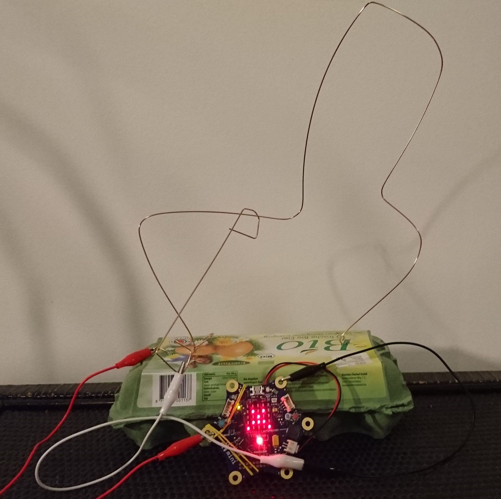
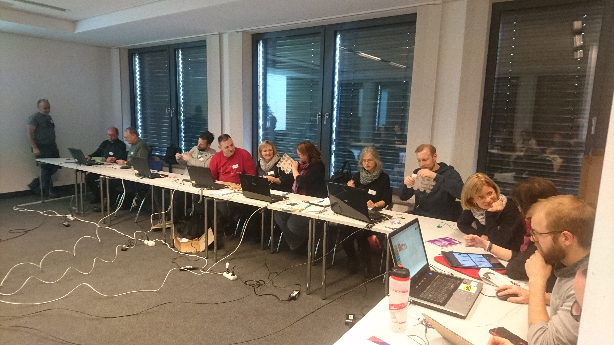
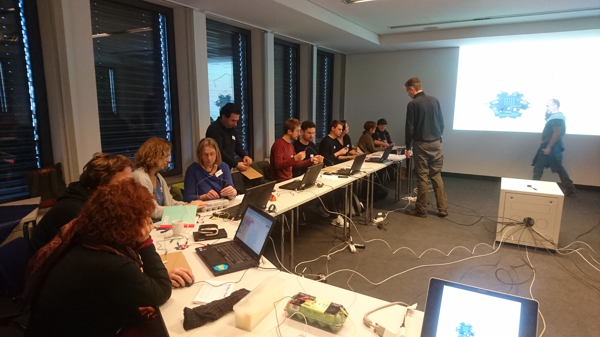
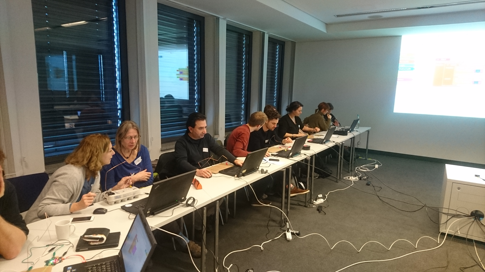

# Heisser Draht

Ein einfaches Calliope Spiel mit ein wenig Bastellspass.

* [Heisser Draht Basis Version](heisserDraht_basic.md) 
* [Heisser Draht Experten Version](heisserDraht_expert.md)

## Voraussetzungen

* [Calliope Mini](http://calliope.cc)
* [NEPOprog / Open Roberta LAB](https://lab.open-roberta.org)

# Events

## Diskurs.Medien.Bildung (II)

[Friedrich Ebert Stiftung, 01.02.2018](doc/FES-Einladung_Diskurs.Medien.Bildung_01.02.18.pdf)

[Apache Licence](LICENSE)
