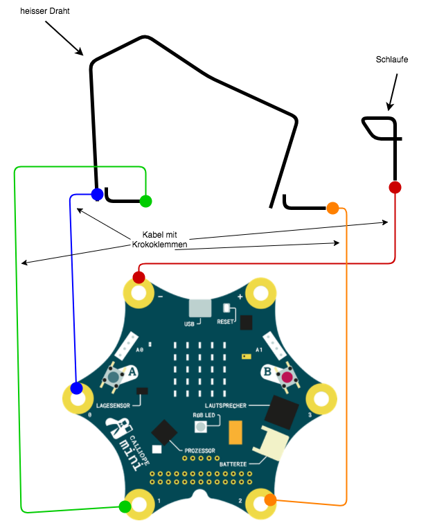

# Heissee Draht (Experten Version)

## Plan

* Biege aus dem Kupferdraht zwei weitere Kontakedrähte
* Montiere die beiden Kontakedrähte an den Anfang und das Ende des heissen Drahtes
* Verbinde den Kontakedraht am Anfang des heissen Draht mit P1
* Verbinde den Kontakedraht am Ende des heissen Draht mit P2

## Basis Version des Programms

* Das Spiel soll initial in einem Pause Zustand sein
** dieser wird von der LED mit Weiß angezeigt
* Das Berühren des Start-Kontakedrahtes soll das Spiel starten 
* Das Berühren des Ende-Kontakedrahtes soll das Spiel stoppen
* Die Spielzeit soll gemessen werden 
* Das Drücken der Taste A stoppt das Spiel und führt in den Pause Modus
* Das Drücken der Taste B Zeigt den letzten Werte von Kontakte und Spielzeit an

### Nützliche Blöcke

* "schreibe" (Variablen)
* "setze Zeitgeber1 zurück" (Sensoren)
* "gib Wert ms Zeitgeber 1" (Sensoren)

## Lösungen

[Link zu den Lösungen](heisserDraht_solutions.md)