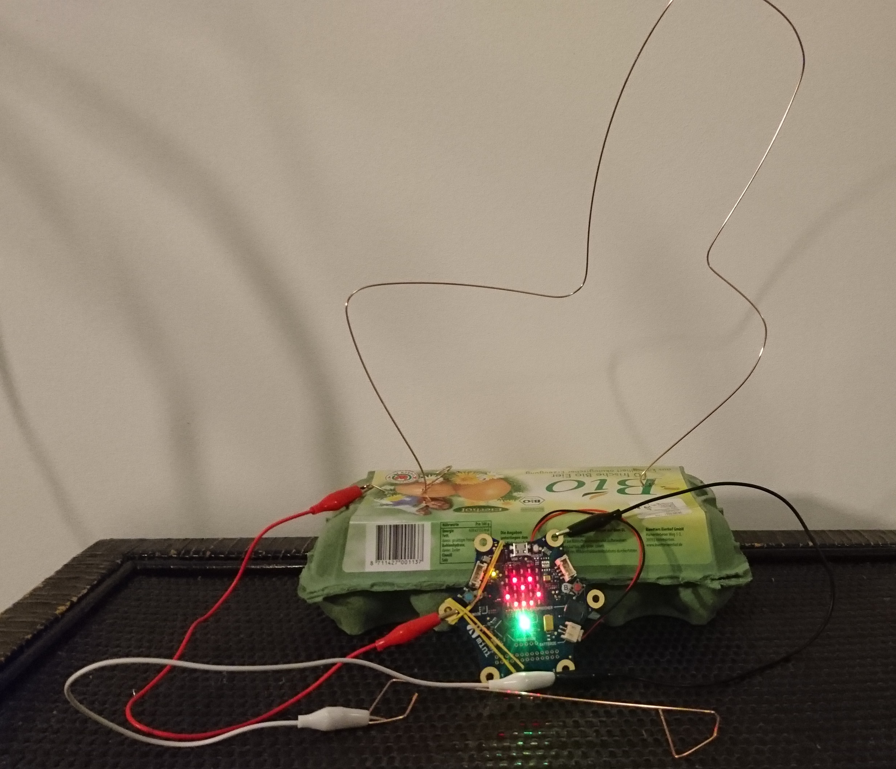
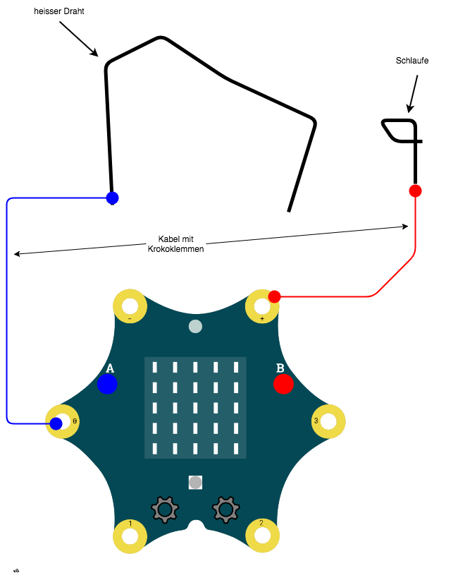
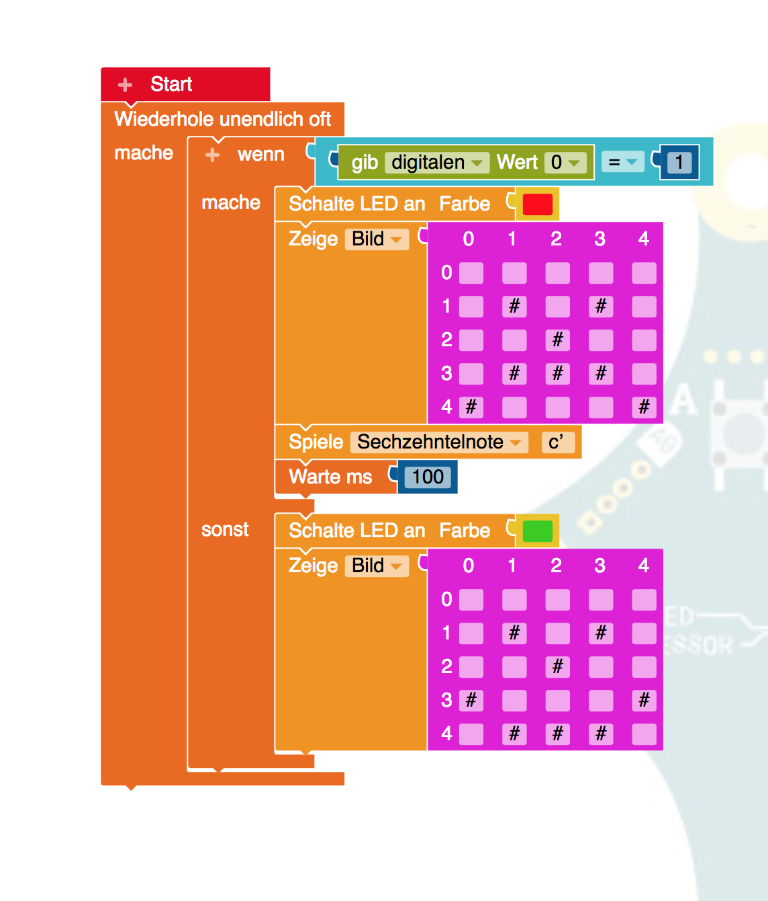

# Heisse Draht (einfache Verison)

## Ziel 

## Material

* Calliope Mini Board
* NEPO Editor (https://lab.open-roberta.org)
* 3 Kabel mit Krokodilklemmen
* Kupferdraht (z.b. Schweissdraht, 1,2mm dick)
* dicke Pappe / Eierkarton

## Plan

* Biege aus dem Kupferdraht den "heissen Draht" und befestige diesen an der Pappe dem Eierkarton
* Verninde P0 am Calliope Mini mit eienm Kroko-Kabel mit dem heissen Draht
* Biege aus einem kurzen Stück Kupferdraht einen Schlaufe
* Verbinde die Schlaufe mit einem Kroko-Kabel mit + am Calliope Mini

## Erstellen des Programms

### Nützliche Blöcke

* "Schalte LED" (Aktion / Statusleuchte)
* "Zeige" (Aktion / Anzeige)
* "Spiele" (Aktion / Klang)
* "Wiederhole unendlich" (Kontrolle / Schleifen)
* "Wenn" (Konrtrolle / Entscheidung)
* "=" (Logik)
* "gib digitalen Wert" (Sensoren) 

###Tipps zum erstellen des Programms
wird ein Kontakt zum "heissen Draht" hergestellt liefert "gib digitalen Wert" von 

## Lösung

### NEPO Programm

(Download)[./src/HeisserDrahtPlan_V1.xml]
