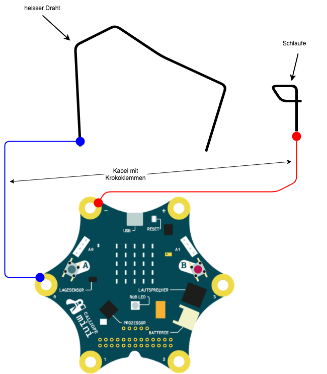

# Heisser Draht

## Ziel 

## Material

* [Calliope Mini](https://calliope.cc){:target="_blank"} 
* [NEPOprog / Open Roberta LAB](https://lab.open-roberta.org){:target="_blank"}
* 3 Kabel mit Krokodil-Klemmen
* Kupferdraht (z.b. Schweissdraht, 1,2mm dick)
* dicke Pappe / Eierkarton

## Plan

* Biege aus dem Kupferdraht den "heissen Draht" und befestige diesen an der Pappe mit dem Eierkarton
* Verbinde P0 am Calliope Mini mit einem Kroko-Kabel mit dem heissen Draht
* Biege aus einem kurzen Stück Kupferdraht eine Schlaufe
* Verbinde die Schlaufe mit einem Kroko-Kabel mit - am Calliope Mini

## Basis Version des Programms

* Das Programm soll endlos prüfen ob der Spieler der heissen Draht berührt hat
* Solange es keinen Kontakt gibt soll die Farb LED grün leuchten
* Gibt es einen Kontakt, dann
  * soll die Farb LED grün leuchten
  * soll ein Ton den Kontakt signalisieren

### Nützliche Blöcke

* "Schalte LED" (Aktion / Statusleuchte)
* "Spiele" (Aktion / Klang)
* "Pin 0 gedrückt?" (Sensoren)
* "Wiederhole unendlich" (Kontrolle / Schleifen)
* "Wenn" (Kontrolle / Entscheidung)

## Erweiterte Version des Programms

* Jeder erfolgte Kontakt soll gezählt werden
* Wird die Taste A gedrückt: 
** soll der aktuelle Zählerstand ausgegeben werden 
** soll nach der Anzeige der Zählerstand auf 0 gesetzt werden 
* So lange kein Kontakt statt findet soll ein freundliches Symbol mit der 5x5 LED Matrix dargestellt werden  
* Gibt es einen Kontakt, soll ein unfreundliches Symbol mit der 5x5 LED Matrix dargestellt werden  

### Nützliche Blöcke

* "Variable"
* "Zeige Bild" (Aktion / Anzeige)
* "erhöhe um" (Mathematik)
* "Warte" (Kontrolle / Warten)
* "Taste A gedrückt?" (Sensoren) 

## Lösungen

[Link zu den Lösungen](heisserDraht_solutions.md)